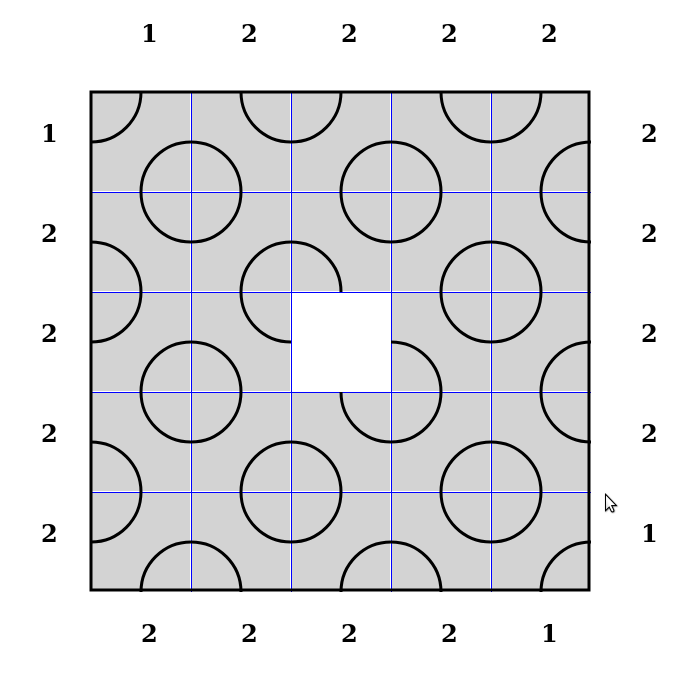
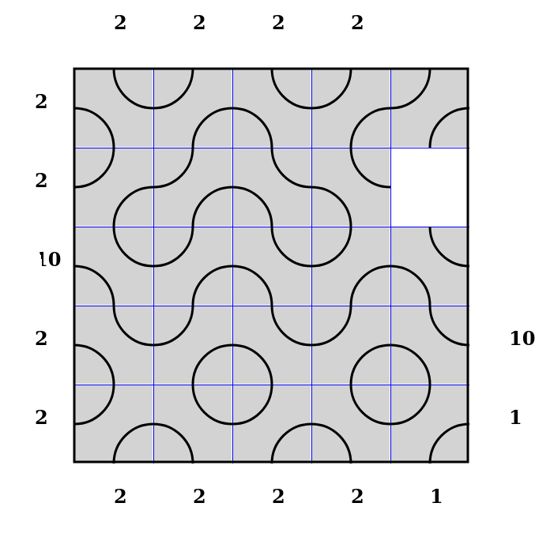

# Меандр

В исходной позиции 24 одинаковые квадратные плитки раскладываются на доске так, как показано на рисунке, оставляя незанятой одну клетку в центре доски. Игроки делают ходы поочередно, перемещая один квадрат или "столбик" из двух, трех или четырех квадратиков, расположенных по горизонтали или вертикали. 

Игра продолжается до тех пор, пока один из игроков не выиигрывает, сложив узор, в котором по крайней мере три плитки образуют непрерывную линию, соединяющие два края доски.

В данной реализации игры нет контроля окончания и определения победителя. Поэтому ее можно продолжать сколь угодно долго и видоизменять правила. Например, засчитывать первому игроку линии проведенные от верхнего края доски к нижнему, а второму игроку линии от левого края доски к правому. Или как-нибудь еще. Например, использовать ее как "пасьянс" или головоломку, определяя, конфигурацию с макисмальной длиной пути и количество ходов необходимое для этого. 

